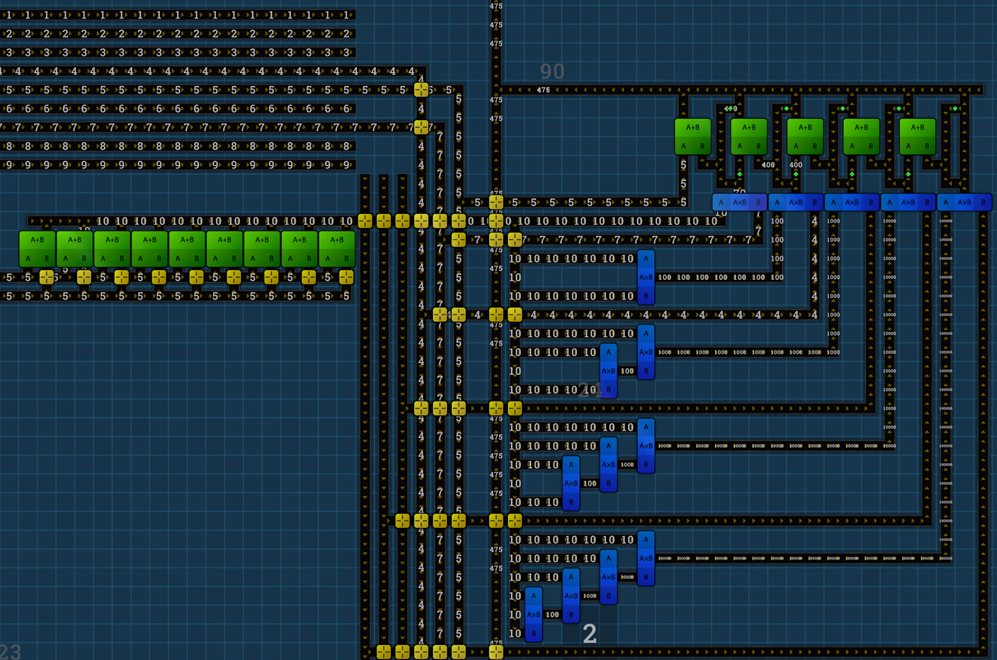

In Beltmatic you have basic numbers (starting with only 1, later 1-9 and so) and mathematical operations (add, multiply and so). 

I didn't wanted to calculate each new number, so I just build me one "picker". So I can just choose the single digits of a large number. For faster delivery the blueprint needs to be copied to the bottom and collect more 10's.

