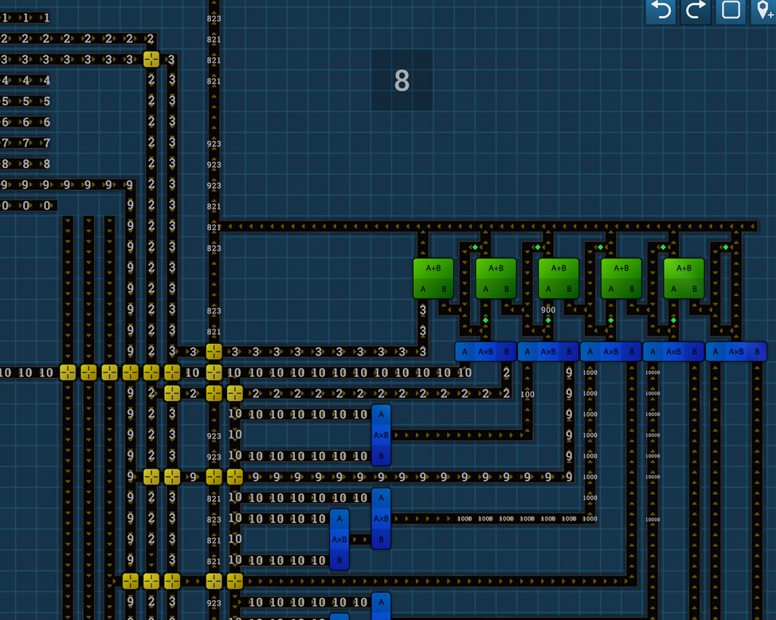

[Back](../../README.md)

In Beltmatic you have basic numbers (starting with only 1, later 1-9 and so) and mathematical operations (add, multiply and so). 

I didn't wanted to calculate each new number, so I just build me one "picker". So I can just choose the single digits of a large number. For faster delivery the blueprint needs to be copied to the bottom and collect more 10's.

Only downside of that: The game become pretty boring after having that "picker" and I stopped playing it. No new things needed to be done in the first hours after having this setup. Shapez 2 e.g. provide much more longtime fun by providing every milestones new possibilites and gameplay loops.
