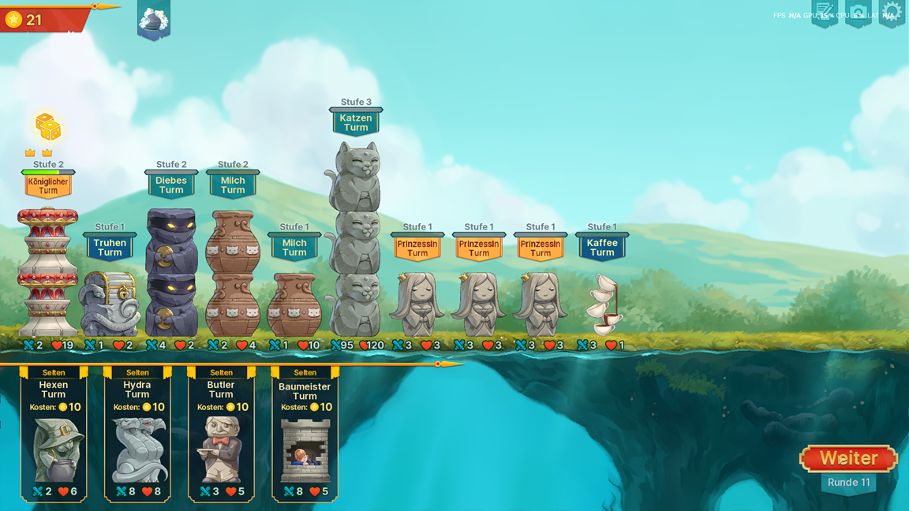

[Back](../../../../README.md)

This is the easiest build in my opinion, because its very easy to setup, dont need much actions and clicks to do and scales very hard into the lategame and harder ascensions. I'm currently pushed my ascension until level 20 with this build.

# Preparation

* Have the extended starting options by finish a run minimum until round 6
* You need to bug abuse two things
  * Starting option "Milk token and cat token"
  If its not available you can change the starting options by select one, go into the game and instantly go back to main menue before the shop is shown and start new game
  * First Relict "Stairway to heaven"
  If its not available, you can change the relict options by press Esc after boss spawns, go back to main menue if its not available in the background and resume the game

# Build

* Starting option: Milk and cat token

## Early Game

### Round 1: build chest and cat tower, give it the milk and the cat token

The cat will get an extra 1 atk/health for each milk and more important automatically get an additional milk every round to scale up in the early very fast.

### Round 2: Add milk

The milk tower give the cat more milk to scale faster.

(optional): Add the thieve tower for some extra coins. It also buff the chest tower which could be helpful also for the round 10 boss. You can also skip it until the early core setup is finished.

### Round 4: Early core setup

The level 2 milk tower gives the milk 2 fields in front, so its an additional milk for the cat each round. Cat level 2 get more stats for each milk

### Round 10: Boss setup

You want to get the towers in that order:
* Cat level 3
* Coffee
* Thieve level 2
* (optional) Put lucky hit Princesses from left to right
* (optional) If you are lucky with cats, you can push her already to level 4

Afterwards you save some coins up to 30+ until the bossfight. Be careful to have some additional coins for rolling the princesses. If you hit earlier luckily princesses, reduce the amount of coins you save.

Some alternatives options:
* An early glas tower can help with the boss if you struggle getting cat scaled up fast or have higher ascensions 20+

### After first boss: Setup princesses

After the bossfight you only can get rare towers. So roll for the 3 princesses.

### Midgame

Level up the towers in that order:
* Cat
* Coffee
* Chest until level 2
* Thieve until level 4

At some point the automatic leveling up of the princess do the rest and you can just go afk.

