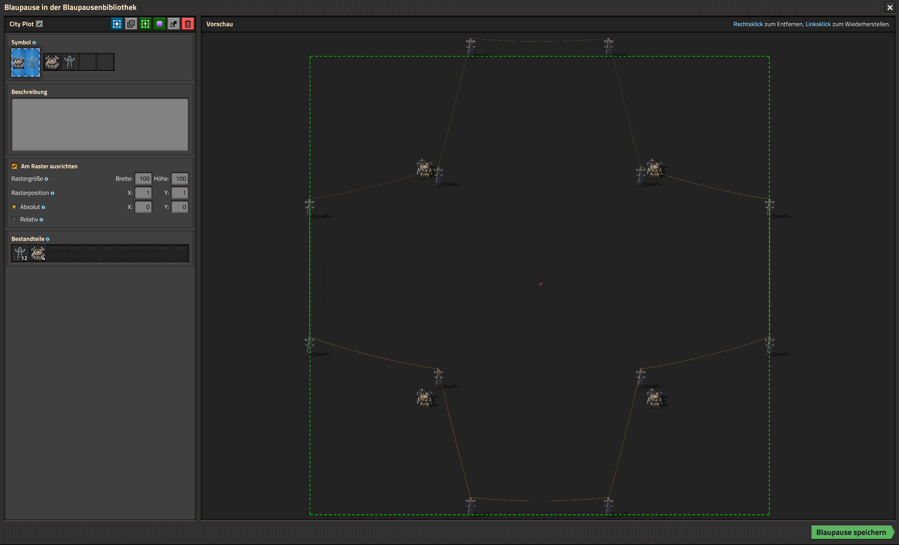

Collection of blueprints works on its own, so no need to create a blueprint book for them.

# How to use it

Copy the codes here, import the blueprints in the game and use them.

# Blueprints

## City Plot

```0eNqtlVFvgyAQx7/KwvOZCBZRX/cF9t40jbbMkFBwiNuaxu8+wLZZVtsMtyf/d/F+xx1wnFAjB94ZoSyqTqhXdZdYnbRG7L39iSqcpoCO4TsCqptey8HyxP/ZCdWiypqBAxI7rXpUrR1DtKqWPlrVB44qZHSjO20scvFC7bmHjjDzYyPahEu+s0bskk5L/i2CjBtAXFlhBZ/yBOO4VcOh4cYh4T4GUKd7F6nVuaiMhprS0a/jB4jEgPIHoAxuOnATT6Z4Ql2lhr8NvLfbVyEtN33YD5dcXBp77d1mLtvqF9nYv2WjMU0ixZS2mCPlMSRGHpBYDGk61BmdAxUxoMv9mEeV8WvKZ0E4XbKoOyy8YPcYmUWRBdt3BxVxX9jfTzCOuDD/kY4umE9+5s6x8gUjKrDcDP0QJgzQNQYKBOgGgqJBORvyoLyHBeVsKIJyNpRBORvcifSy9BJPnNTrM9ND8UT1LsAT17sm7dYiLD/4Iq5PECBZN9y9CejZFfz0IrX3vbt2h3poTspVWdIVKxll2Th+AaxbMPQ=```

Have a robot network over the complete area and a power network for the complete base. Split the base in separated single responsibility units to make it easy to scale and refactor each of the plot without reordering and moving the complete base.


